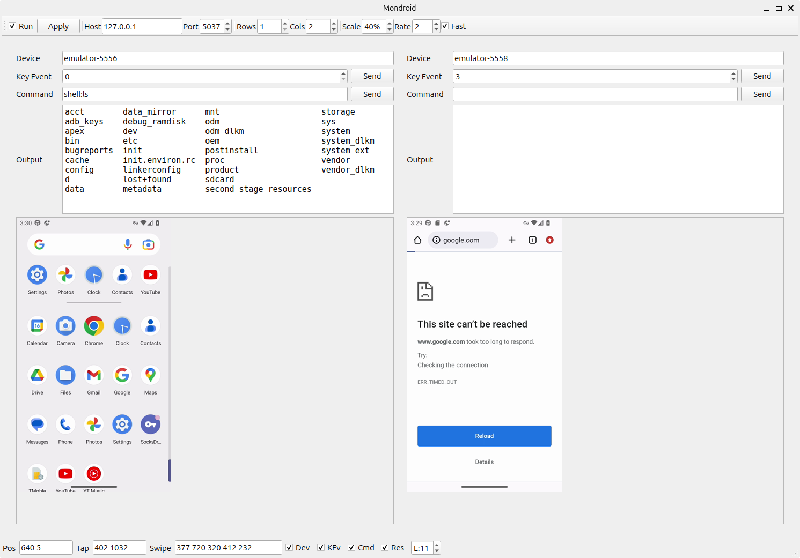

# Mondroid

`Mondroid` is an Qt/C++ application for remote controlling **MULTIPLE** Android devices (or virtual machines) using ADB.

***I'm developing it for my personal purposes***.

Based on  [DivvyDroid](https://github.com/maxrd2/DivvyDroid/), actually heavily reworked.

## License
Released under [GNU General Public License v3.0](LICENSE)
